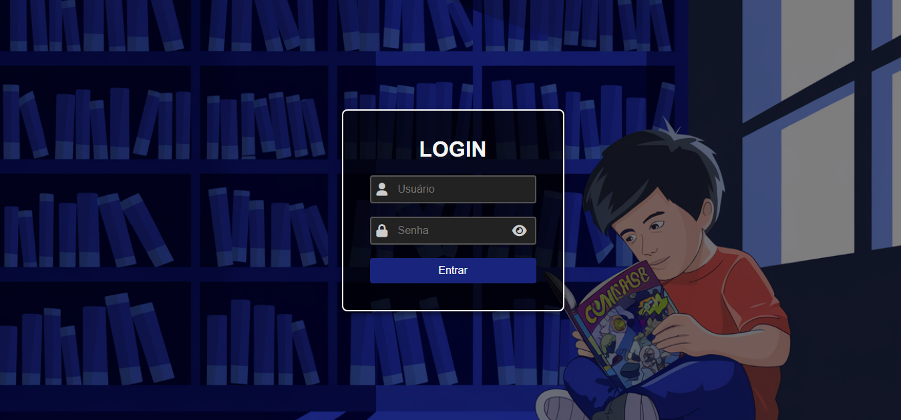
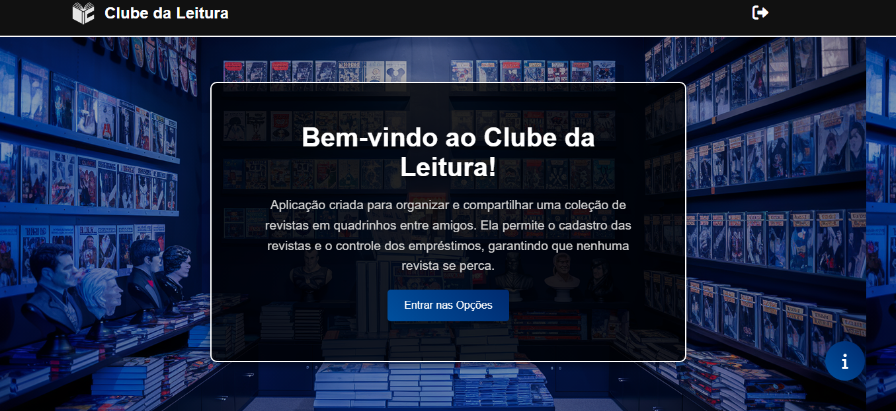
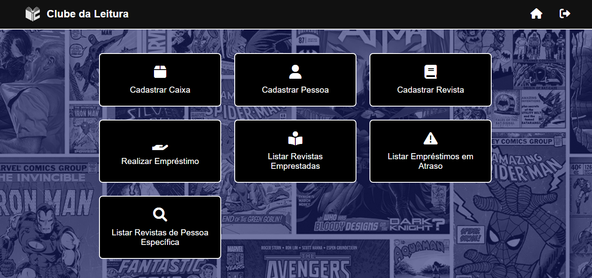
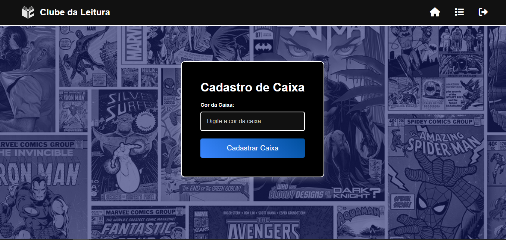
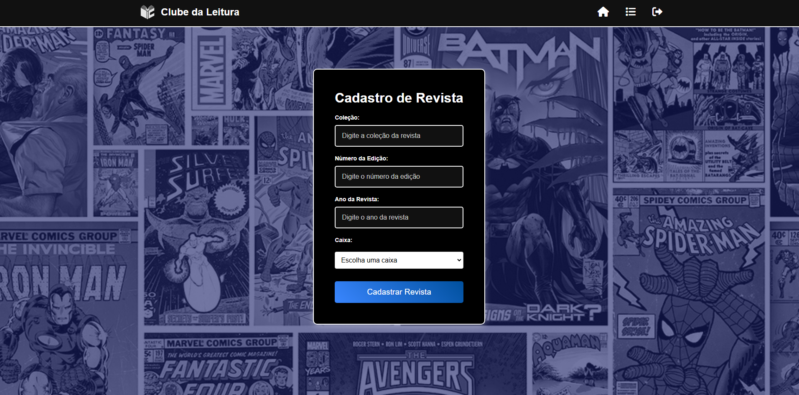
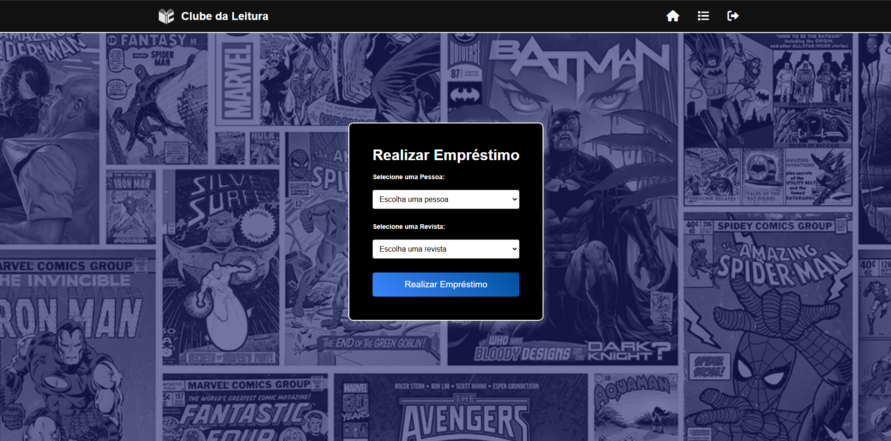

# Clube Leitura 📚

Um sistema para gerenciar empréstimos, devoluções e cadastros de revistas, caixas e pessoas em um clube de leitura. Este projeto foi desenvolvido usando Java para o backend e uma combinação de HTML, JSP, CSS e JavaScript para o frontend.

---

## 📂 Estrutura do Projeto

### Backend

O backend foi desenvolvido em Java e segue a seguinte estrutura:

- **Pacote `main.java.tsi.daw.bd`**
  - `ConnectionFactory`: Classe responsável por gerenciar a conexão com o banco de dados.
  - `DataBaseSchema`: Define os nomes das tabelas do banco de dados.

- **Pacote `main.java.tsi.daw.controller`**
  - `ClubeLeituraController`: Servlet única responsável por controlar as requisições do sistema.

- **Pacote `main.java.tsi.daw.dao`**
  - `CaixaDAO`
  - `EmprestimoDAO`
  - `PessoaDAO`
  - `RevistaDAO`
  - `UsuarioDAO`

- **Pacote `main.java.tsi.daw.model`**
  - `Caixa`
  - `Emprestimo`
  - `Pessoa`
  - `Revista`
  - `Usuario`

- **Pacote `main.java.tsi.daw.service`**
  - `EfetuaLogin`
  - `EfetuaLogout`
  - `RegisterBox`
  - `RegisterLoan`
  - `RegisterMagazine`
  - `RegisterPerson`
  - `RegisterReturn`
  - `Service`: Interface herdada pelos serviços, para acessar a Servlet de controle

---

### Frontend

O frontend foi desenvolvido com **HTML**, **JSP**, **CSS** e **JavaScript**, com as seguintes funcionalidades:

- **Páginas JSP**:
  - `login.jsp`: Página de login do sistema.
  - `home_page.jsp`: Página inicial após login.
  - `options.jsp`: Página de opções para realizar ações no sistema.

- **Funcionalidades Disponíveis**:
  - Cadastro de caixas.
  - Cadastro de revistas.
  - Cadastro de pessoas.
  - Lista dos empréstimos, com opção para fazer a devolução.
  - Verificação de empréstimos atrasados.
  - Verficação de empréstimos por pessoa.

---

## 🛠️ Tecnologias Utilizadas

- **Backend**: Java (Servlets, DAO, JDBC)
- **Frontend**: HTML, JSP, CSS, JavaScript
- **Banco de Dados**: PostgreSQL

---

## 📸 Prints das Telas

### Login


### Página Inicial


### Opções


### Cadastro de Caixa


### Cadastro de Revista


### Registro de Empréstimo


### Devolução de Empréstimo


---

## 🚀 Como Executar

1. Clone este repositório:
   ```bash
   git clone https://github.com/seu-usuario/ClubeLeitura.git
   ```
2. Configure o banco de dados:
   
   - Crie o banco de dados conforme as definições em `DataBaseSchema`.
   - Edite a classe `ConnectionFactory` para incluir o nome de usuário e a senha do banco.

4. Configure o projeto no servidor de aplicações:
   - Use um servidor como Tomcat para rodar o projeto.
   
6. No navegador, acesse
   ```bash
   http://localhost:8080/ClubeLeitura/
   ```
